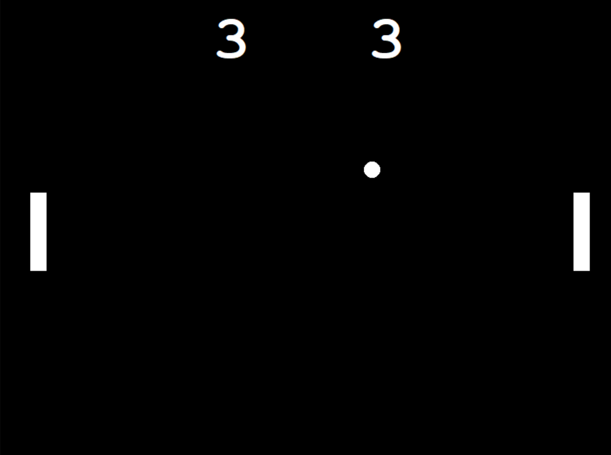

# Pong Game



This repository contains a simple implementation of the classic Pong game using Python and the Turtle graphics library. The game is designed for two players, with player one using the "w" and "s" keys to move up and down, and player two using the up and down arrows to move up and down.

## Requirements

To run the Pong game, you need to have the following requirements installed:

- Python 3.x
- Turtle graphics library

## Installation

1. Clone this repository to your local machine or download the ZIP file.
   ```
   git clone https://github.com/your-username/Pong-Game.git
   ```

2. Navigate to the project directory.
   ```
   cd Pong-Game
   ```

3. Run the game.
   ```
   python main.py
   ```

## How to Play

- Player One:
  - Move Up: Press the "w" key
  - Move Down: Press the "s" key

- Player Two:
  - Move Up: Press the up arrow key
  - Move Down: Press the down arrow key

The objective of the game is to bounce the ball off the paddles and prevent it from reaching the edges of the screen. Each time a player misses the ball, the opposing player scores a point. The first player to reach a specified number of points wins the game.

## Contributing

Contributions to this project are welcome. If you find any issues or have ideas for improvements, please open an issue or submit a pull request.

## License

This project is licensed under the [MIT License](LICENSE).

---

Enjoy playing Pong and have fun! If you have any questions or need further assistance, feel free to contact me.